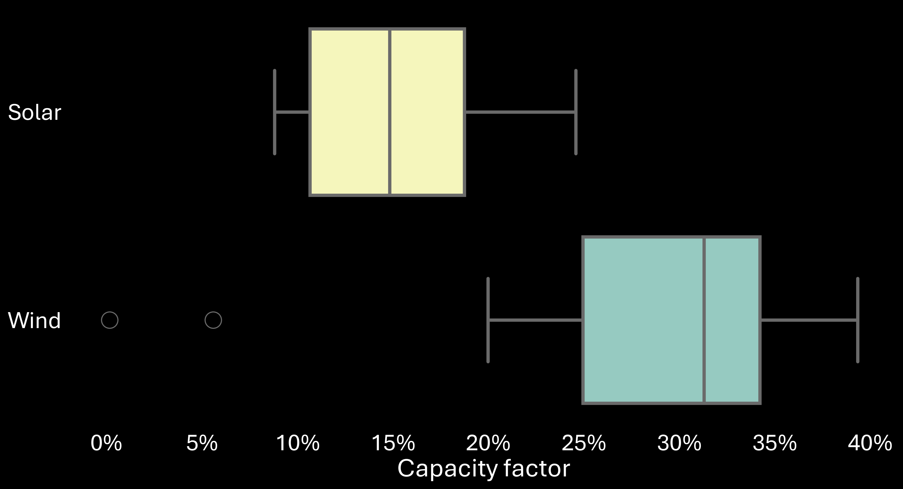
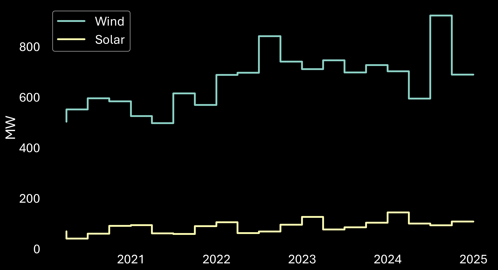
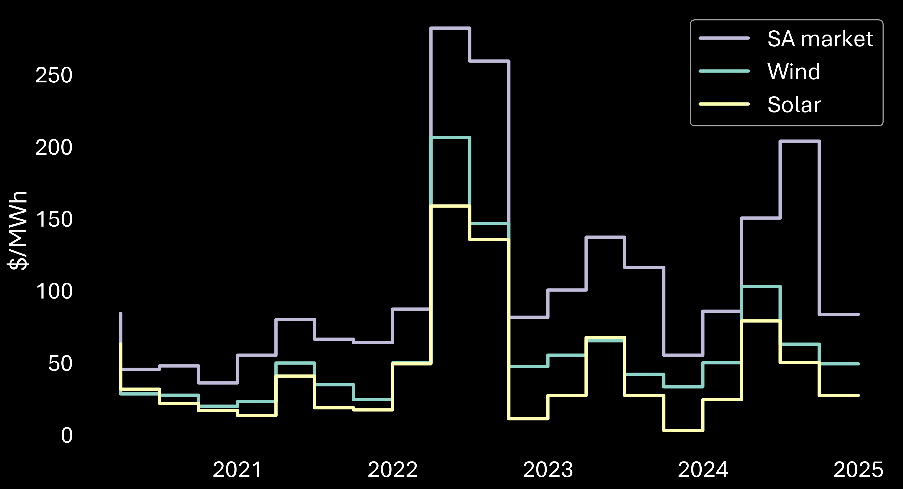

#### **NEM Review contract co-design workshop**

# Contract financial performance modelling

## Contents

* [Initial modelling approach](#initial-modelling-approach)
  * [Data profiles](#data-profiles)
  * [Existing generator locations](#existing-generator-locations)
* [Potential modelling updates](#potential-modelling-updates)
* [SA wind and solar market observations](#sa-wind-and-solar-market-observations)
  * [Size of fleet](#size-of-fleet)
  * [Capacity factors](#capacity-factors)
  * [Seasonal generation and load](#seasonal-generation-and-load)
  * [Intraday generation and load](#intraday-generation-and-load)
  * [Demand-weighted-average prices](#demand-weighted-average-prices)
  * [Spot price exposure](#spot-price-exposure)
---

## [Initial modelling approach](#initial-modelling-approach)

### [Data profiles](#data-profiles)

* All contract parties (suppliers and buyers) are in the South Australian market
* Generation and price profiles are based on historic SA data (5 years of data: 2020 to 2024)
* Suppliers include:
  - **Existing wind**: all existing utility-scale SA wind stations, scaled to 250 MW
  - **Existing solar**: all existing utility-scale SA solar stations, scaled to 250 MW
  - **Existing wind-solar hybrid**: Port Augusta Renewable Energy Park wind and solar profile, scaled to 250 MW each of wind/solar
* Buyers' demand reflects the SA load profile

### [Existing generator locations](#existing-generator-locations)

* 26 wind generators
* 16 solar generators

[Back to top](#top)

---

## [Potential modelling updates](#potential-modelling-updates)

* Incorporate hybrid stations:
  * **Wind-battery hybrid**: A hypothetical station with wind profile based on Hornsdale 3, scaled to 250 MW with 100 MW (200 MWh) battery
  * **Solar-battery hybrid**: A hypothetical station wind profile based on Bungala 2, scaled to 250 MW with 100 MW (200 MWh) battery
* Hybrid stations' battery behaviour will be based on heuristics, prioritising defence of the station's contract position
* Incorporate seasonal generation data from AEMO's Generation Information, with contracts tailored to varying maximum capacities
* Expand modelling to all NEM regions
* Synthesise generation and price data to test contracts against a wider range of outcomes

[Back to top](#top)

---

## [SA wind and solar market observations](#sa-wind-and-solar-market-observations)

### [Size of fleet](#size-of-fleet)

**Maximum capacity** (MW, 2020 to 2024 – monthly changes)

[Back to section top](#sa-wind-and-solar-market-observations)

### [Capacity factors](#capacity-factors)

Generator capacity factors are calculated from dispatched output rather than availability. The aggregate fleet capacity factors over the 5 years analysed are:
* Solar: **19.4%**
* Wind: **30.6%**

**Distributions of generator capacity factors**

[Back to section top](#sa-wind-and-solar-market-observations)

### [Seasonal generation and load](#seasonal-generation-and-load)

**Mean quarterly generation (availability)** (MW, 2020 to 2024)

**Mean quarterly load** (MW, 2020 to 2024)

[Back to section top](#sa-wind-and-solar-market-observations)

### [Intraday generation and load](#intraday-generation-and-load)

[Back to section top](#sa-wind-and-solar-market-observations)

### [Demand-weighted-average prices](#demand-weighted-average-prices)

Demand-weighted-average prices are weighted by:
* Total demand (or operational demand) for the SA market price
* Availability for solar and wind generation

**Quarterly demand-weighted-average prices** ($/MWh, 2020 to 2024)

[Back to section top](#sa-wind-and-solar-market-observations)

### [Spot price exposure](#spot-price-exposure)

[Back to section top](#sa-wind-and-solar-market-observations)

[Back to top](#top)