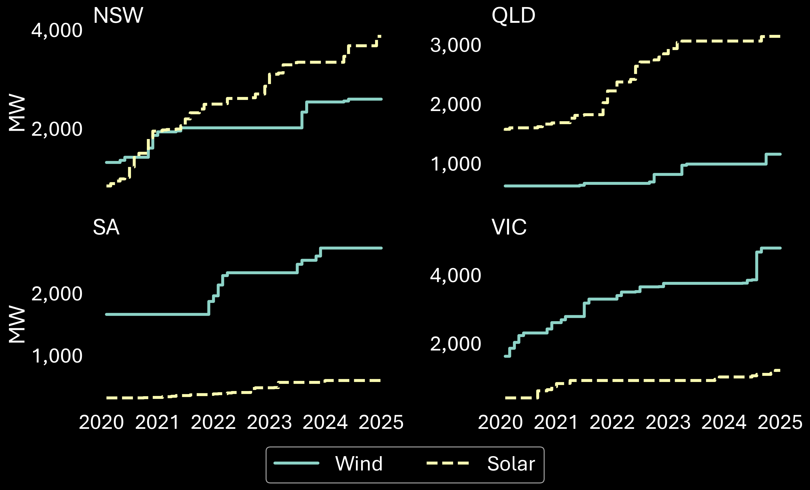
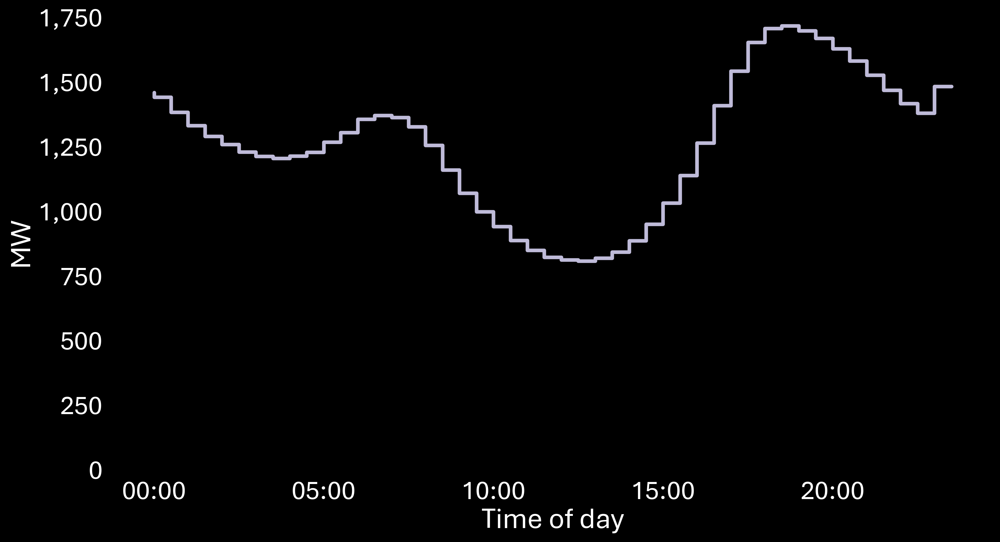
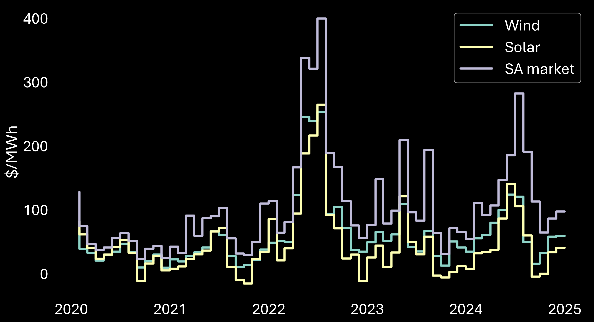

#### **NEM Review contract co-design workshop**

# Contract financial performance modelling

## Contents

* [Initial modelling approach](#initial-modelling-approach)
  * [Data profiles](#data-profiles)
  * [Existing generators](#existing-generators)
* [Potential modelling updates](#potential-modelling-updates)
* [Wind and solar market observations](#wind-and-solar-market-observations)
  * [Size of fleet](#size-of-fleet)
  * [Capacity factors](#capacity-factors)
  * [Seasonal generation and load](#seasonal-generation-and-load)
  * [Intraday generation and load](#intraday-generation-and-load)
  * [Volume-weighted average prices](#volume-weighted-average-prices)

---

## [Initial modelling approach](#initial-modelling-approach)

### [Data profiles](#data-profiles)

* Contract parties (suppliers and buyers) are from each NEM region
* Generation and price profiles are based on 5 years of historic data (2020 to 2024)
* Suppliers include:
  - **Existing wind**: all existing utility-scale wind stations that were operating on 1 January 2020, scaled to 250 MW
  - **Existing solar**: all existing utility-scale solar stations that were operating on 1 January 2020, scaled to 250 MW
  - **Existing wind-solar hybrid**: Port Augusta Renewable Energy Park wind and solar profile, scaled to 250 MW each of wind/solar
* Buyer's demand reflects the demand profile of the buyer's region

### [Existing generators](#existing-generators)

78 generators in the NEM meet the above criteria for this analysis:

| Region | Wind | Solar |
|-|-|-|
| NSW | 10 | 12 |
| QLD | 2 | 19 |
| SA | 16 | 3 |
| VIC | 11 | 5 |

### [Contract concepts](#contract-concepts)

The following contract concepts, for suppliers and buyers, will be modelled (this list will likely expand):
* PPAs
* Baseload swaps
* Caps
* Wind DWA swap
* Solar DWA swap
* Wind DWA revenue swap
* Solar DWA revenue swap
* Wind ToD (8pm to 6am)
* Solar ToD (10am to 4pm)
* ASX morning peak (6am to 9am)
* ASX evening peak (4pm to 9pm)
* Price spread
* Wind DWA-TWA spread
* Solar DWA-TWA spread

[Back to top](#top)

---

## [Potential modelling updates](#potential-modelling-updates)

* Incorporate hybrid stations:
  * **Wind-battery hybrid**: A hypothetical station with wind profile based on Hornsdale 3, scaled to 250 MW with 100 MW (200 MWh) battery
  * **Solar-battery hybrid**: A hypothetical station wind profile based on Bungala 2, scaled to 250 MW with 100 MW (200 MWh) battery
* Hybrid stations' battery behaviour will be based on heuristics, prioritising defence of the station's contract position
* Incorporate seasonal generation data from AEMO's Generation Information, with contracts tailored to varying maximum capacities
* Synthesise generation and price data to test contracts against a wider range of outcomes
* Incorporate all NEM regions

[Back to top](#top)

---

## [Wind and solar market observations](#wind-and-solar-market-observations)

### [Size of fleet](#size-of-fleet)

**Maximum capacity** (MW, 2020 to 2024 – monthly changes)

[Back to section top](#sa-wind-and-solar-market-observations)

### [Capacity factors](#capacity-factors)

Generator capacity factors are calculated from dispatched output (net of curtailment). The aggregate fleet capacity factors over the 5 years analysed are:

| Region | Wind | Solar |
|-|-|-|
| NSW | 29.4% | 20.9% |
| QLD | 30.3% | 20.6% |
| SA | 30.6% | 19.4% |
| VIC | 26.7% | 18.8% |

**Distributions of generator capacity factors**

[Back to section top](#sa-wind-and-solar-market-observations)

### [Seasonal generation and load](#seasonal-generation-and-load)

**Mean monthly generation** (MW, 2020 to 2024)

**Mean monthly load** (MW, 2020 to 2024)

[Back to section top](#sa-wind-and-solar-market-observations)

### [Intraday generation and load](#intraday-generation-and-load)

**Mean intraday generation per 30-minute interval** (MW, 2020 to 2024)

**Mean intraday load per 30-minute interval** (MW, 2020 to 2024)

[Back to section top](#sa-wind-and-solar-market-observations)

### [Volume-weighted average prices](#demand-weighted-average-prices)

Volume-weighted average prices are weighted by:
* Total demand (operational demand) for the SA market price
* Dispatched output (net of curtailment) for solar and wind generation

**Monthly volume-weighted average prices** ($/MWh, 2020 to 2024)

[Back to section top](#sa-wind-and-solar-market-observations)

[Back to top](#top)