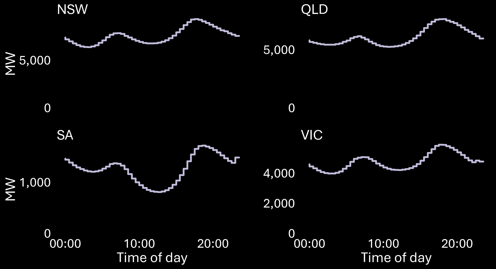
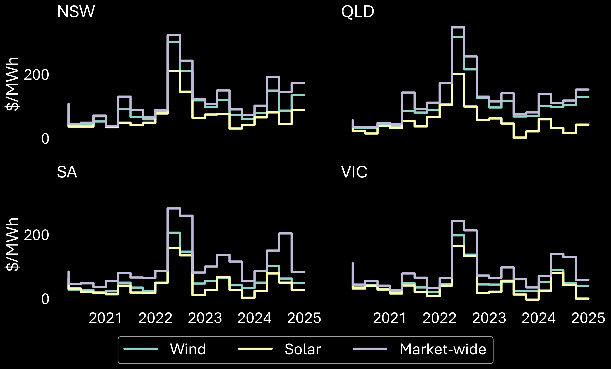

#### **NEM Review contract co-design workshop**

# Contract financial performance modelling

## Contents

* [Initial modelling approach](#initial-modelling-approach)
  * [Data profiles](#data-profiles)
  * [Existing generators](#existing-generators)
  * [Contract concepts](#contract-concepts)
  * [Finance and cost assumptions](#finance-and-cost-assumptions)
* [Potential modelling updates](#potential-modelling-updates)
* [Wind and solar market observations](#wind-and-solar-market-observations)
  * [Size of fleets](#size-of-fleets)
  * [Capacity factors](#capacity-factors)
  * [Seasonal generation and load](#seasonal-generation-and-load)
  * [Intraday generation and load](#intraday-generation-and-load)
  * [Volume-weighted average prices](#volume-weighted-average-prices)

---

## [Initial modelling approach](#initial-modelling-approach)

### [Data profiles](#data-profiles)

* Contract parties (suppliers and buyers) are from each NEM region
* Generation and price profiles are based on 5 years of historic data (2020 to 2024)
* Suppliers include:
  - **Existing wind**: all existing utility-scale wind stations that were operating on 1 January 2020, scaled to 250 MW
  - **Existing solar**: all existing utility-scale solar stations that were operating on 1 January 2020, scaled to 250 MW
  - **Existing wind-solar hybrid**: Port Augusta Renewable Energy Park wind and solar profile, scaled to 250 MW each of wind/solar
* Buyer's demand reflects the demand profile of the buyer's region

### [Existing generators](#existing-generators)

78 generators in the NEM meet the above criteria (i.e. 5 full years of generation):

| Region | Wind | Solar |
|-|-|-|
| NSW | 10 | 12 |
| QLD | 2 | 19 |
| SA | 16 | 3 |
| VIC | 11 | 5 |

### [Contract concepts](#contract-concepts)

The following contract concepts will be modelled (this list will likely expand):
* Run of plant PPA
* TWA (baseload) swap
* $300 cap
* Reference ex-post DWA swap
* Reference ex-post revenue swap
* Fixed shape DWA price swap
* ToD block price swap (aligned with ASX morning and evening peaks)
* DWA-TWA spread

### [Finance and cost assumptions](#finance-and-cost-assumptions)

Financing assumptions are variables, which can be adjusted. Cost assumptions are sourced from [CSIRO's GenCost 2024-25](https://www.csiro.au/en/research/technology-space/energy/Electricity-transition/GenCost) (using 2024 prices under the 'current policies' scenario).

#### Finance

| Metric | Value |
|-|-|
| Leverage ratio | 65% |
| Loan rate | 5% |
| Equity rate | 15% |
| Weighted average cost of capital | 8.5% |

#### Costs

| | Wind | Solar |
|-|-|-|
| Capital expenditure *(\$/kW)* | $3,351 | $1,463 |
| Economic life *(years)* | 25 | 30 |
| Fixed operating & maintenance costs *(\$/kW/year)* | $28 | $12 |
| Annualised costs ($/MW/year) | **$355,432** | **$148,133** |

[Back to top](#top)

---

## [Potential modelling updates](#potential-modelling-updates)

* Incorporate hybrid stations:
  * **Wind-battery hybrid**: A hypothetical station with wind profile based on Hornsdale 3, scaled to 250 MW with 100 MW (200 MWh) battery
  * **Solar-battery hybrid**: A hypothetical station wind profile based on Bungala 2, scaled to 250 MW with 100 MW (200 MWh) battery
* Hybrid stations' battery behaviour will be based on heuristics, prioritising defence of the station's contract position
* Incorporate seasonal generation data from AEMO's Generation Information, with contracts tailored to varying maximum capacities
* Synthesise generation and price data to test contracts against a wider range of outcomes
* Incorporate all NEM regions

[Back to top](#top)

---

## [Wind and solar market observations](#wind-and-solar-market-observations)

### [Size of fleets](#size-of-fleets)

**Maximum capacity** (MW, 2020 to 2024 – monthly changes)

[Back to section top](#wind-and-solar-market-observations)

### [Capacity factors](#capacity-factors)

Generator capacity factors are calculated from dispatched output (net of curtailment). The aggregate fleet capacity factors over the 5 years analysed are:

| Region | Wind | Solar |
|-|-|-|
| NSW | 29.4% | 20.9% |
| QLD | 30.3% | 20.6% |
| SA | 30.6% | 19.4% |
| VIC | 26.7% | 18.8% |

**Distributions of generator capacity factors**

[Back to section top](#wind-and-solar-market-observations)

### [Seasonal generation and load](#seasonal-generation-and-load)

**Mean quarterly generation** (MW, 2020 to 2024)

**Mean quarterly load** (MW, 2020 to 2024)

[Back to section top](#wind-and-solar-market-observations)

### [Intraday generation and load](#intraday-generation-and-load)

**Mean intraday generation per 30-minute interval** (MW, 2020 to 2024)

**Mean intraday load per 30-minute interval** (MW, 2020 to 2024)

[Back to section top](#wind-and-solar-market-observations)

### [Volume-weighted average prices](#volume-weighted-average-prices)

Volume-weighted average prices are weighted by:
* Total demand (operational demand) for the SA market price
* Dispatched output (net of curtailment) for solar and wind generation

**Quarterly volume-weighted average prices** ($/MWh, 2020 to 2024)

[Back to section top](#wind-and-solar-market-observations)

[Back to top](#top)