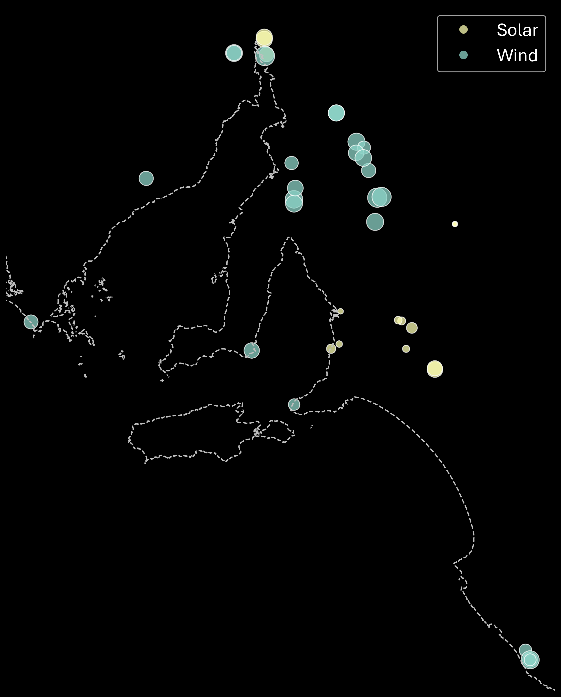

#### **NEM Review contract co-design workshop**

# Contract financial performance modelling

## Initial modelling approach

### Data profiles

* All contract parties (suppliers and buyers) are in the South Australian market
* Generation and price profiles are based on historic SA data (5 years of data: 2020 to 2024)
* Suppliers include:
  - **Existing wind**: all existing utility-scale SA wind stations, scaled to 250 MW
  - **Existing solar**: all existing utility-scale SA solar stations, scaled to 250 MW
  - **Existing wind-solar hybrid**: Port Augusta Renewable Energy Park wind and solar profile, scaled to 250 MW each of wind/solar
* Buyers' demand reflects the SA load profile

### Existing generator locations

* 26 wind generators
* 19 solar generators

## Potential modelling updates

* Incorporate hydrid stations: 
  - **Wind-battery hydrid**: A hypothetical station with wind profile based on Hornsdale 3, scaled to 250 MW with 100 MW (200 MWh) battery
  - **Solar-battery hydrid**: A hypothetical station wind profile based on Bungala 2, scaled to 250 MW with 100 MW (200 MWh) battery
* Hybrid stations' battery behaviour will be based on heuristics, prioritising defence of the station's contract position
* Incorporate seasonal generation data from AEMO's Generation Information, with contracts tailed to varying maximum capacities 
* Expand modelling to all NEM regions
* Synthesise generation and price data to test contracts against a wider range of outcomes

## SA wind and solar market observations

### Size of fleet

### Capacity factors

Capacity factors are calculated from dispatched output rather not availability.

Aggregate fleet CF over the 5 years:
* Solar: **19.4%**
* Wind: **30.6%**

Distribution of individual CFs:

### Seasonal generation and load

Mean monthly generation (availability), 2020 to 2024:

Mean monthly load, 2020 to 2024:

